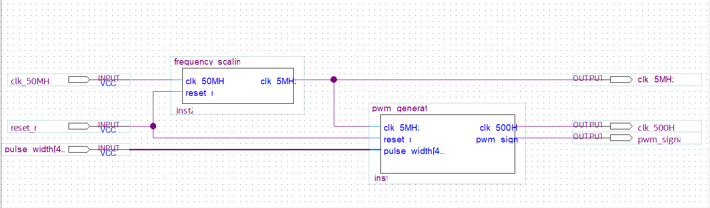
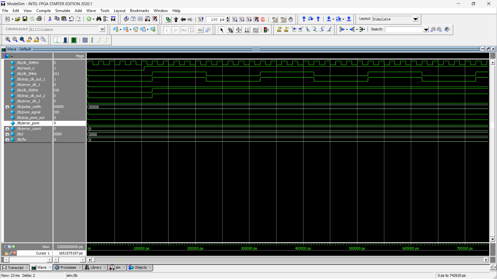

\# FS\_PWM


A Verilog HDL project implementing \*\*Frequency Scaling\*\* and \*\*Pulse Width Modulation (PWM)\*\* using Quartus Prime and ModelSim.


\## Overview


This project demonstrates how a high-frequency FPGA board (Cyclone IV E EP4CE22F17C6) clock can be scaled down and used to generate a PWM signal with a controllable duty cycle.


\### Frequency Scaling


The `frequency\_scaling` module divides the FPGA board's \*\*50 MHz\*\* system clock down to \*\*5 MHz\*\* using a counter-based clock divider.


\### Pulse Width Modulation (PWM)


The `pwm\_generator` module operates on the scaled \*\*5 MHz\*\* clock and generates:


\- A \*\*500 Hz clock\*\*

\- A \*\*PWM output signal\*\*


The PWM signal is generated using the \*\*counter-and-compare\*\* technique, where the output remains high for a configurable portion of each cycle. PWM is commonly used to control the average power delivered to devices such as motors, LEDs, and power converters without dissipating excess energy as heat.


\---


\## Project Structure


```text

fs\_pwm/

├── .test

├── code

├── images

├── fs\_pwm.qpf

├── fs\_pwm.qsf

├── README.md

└── .gitignore

```


\---


\## Modules


\### frequency\_scaling


\*\*Input:\*\*

\- `clk\_50MHz`

\- `reset\_n`


\*\*Output:\*\*

\- `clk\_5MHz`


\*\*Function:\*\*

\- Divides the 50 MHz board clock to generate a 5 MHz clock signal.


\### pwm\_generator


\*\*Input:\*\*

\- `clk\_5MHz`

\- `reset\_n`

\- `pulse\_width\[4:0]`


\*\*Output:\*\*

\- `clk\_500Hz`

\- `pwm\_signal`


\*\*Function:\*\*

\- Generates a 500 Hz clock from the 5 MHz input clock.

\- Produces a PWM signal whose duty cycle is controlled by `pulse\_width`.


\---


\## Block Diagram



## Simulation Waveform



\---

\## Tools Used


\- Quartus Prime Lite Edition

\- ModelSim Intel FPGA Edition

\- Verilog HDL


\---


\## Applications


\- Motor speed control

\- LED brightness control

\- Power regulation

\- FPGA clock management

\- Embedded control systems


\---


\## Author


Kunal Patil

